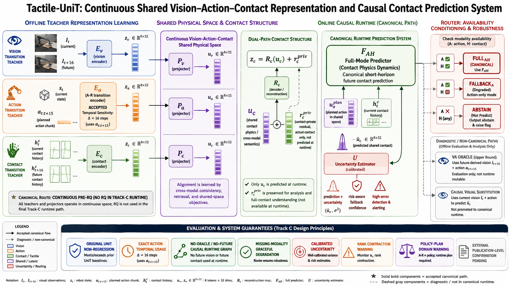

# Tactile3D-UniT

[English](README.md) | [中文](README_zh-CN.md) | [Original UniT README](README_UniT.md)

## 项目概览

Tactile3D-UniT 是基于 [UniT](README_UniT.md) 的研究 fork，研究视觉、动作与
Contact/Tactile 之间的连续共享物理表征。M0-R、S1 与 S2 建立了历史 UniT 以及
Contact 状态/动力学基线。Track C（C1–C6）现已在冻结的 T-Rex 内部表征工程
benchmark 上建立 M3 系统，同时保留下述明确警告。

## M3 系统概览（Track C）

M3 的 canonical Track C 使用连续的 pre-RQ latent，而不是 RQ：

```text
z_v, z_a, z_c ∈ R^(8×32)
u_v = P_v(z_v),  u_a = P_a(z_a),  u_c = P_c(z_c)
z_c = R_c(u_c) + r_c^priv
```

其中 `u_v`、`u_a`、`u_c` 表示共享物理语义，`r_c^priv` 保留 Contact 私有
细节。canonical Contact predictor 为
`u_hat_c = F_AH(u_a^plan, h_t^c)`，完整输入源是 Action 加当前 Contact context。

<p align="center">
  
</p>

<p align="center"><em>Tactile-UniT 框架：连续 Vision–Action–Contact 共享表征、Contact shared/private 分解、因果 Contact 预测、按可用性回退，以及校准不确定性。</em></p>

因果 runtime contract 为：

```text
Action + 当前 Contact context  → FULL_AH
Action、但无当前 Contact      → FALLBACK_A
无 Action                      → ABSTAIN_NO_ACTION
```

`F_AH` 是 canonical full path，`F_A` 是因果的缺失 Contact fallback。`F_VA`
仅是 offline future-Vision upper bound；C5 因果 Vision substitution 仍只是
diagnostic，未被推广。锁定 benchmark 上的不确定性已完成校准，可支持 graceful
degradation。canonical runtime 不依赖 oracle 或 future input，Contact private
residual 也不是预测目标。

**M3 = `ESTABLISHED_WITH_WARNINGS`；Track C = `COMPLETE`。** 这是冻结的内部
表征工程结果，不构成 publication-level generalization 或真实机器人闭环部署声明。

主要限制为：`POLICY_PLAN_DOMAIN_WARNING`、`RANK_CONTRACTION_WARNING`、
`CAUSAL_VISUAL_SUBSTITUTION_NOT_PROMOTED` 与
`PUBLICATION_EXTERNAL_CONFIRMATION_PENDING`。尤其是，尚未验证真实 policy-plan
分布，也没有完成外部 publication confirmation。

受 Git 跟踪的证据与可复现边界由
[`configs/tactile_unit/m3_system_manifest.json`](configs/tactile_unit/m3_system_manifest.json)、
[`configs/tactile_unit/m3_claim_ledger.json`](configs/tactile_unit/m3_claim_ledger.json)、
[`configs/tactile_unit/m3_limitations.json`](configs/tactile_unit/m3_limitations.json)、
[`configs/tactile_unit/m3_external_confirmation_protocol.json`](configs/tactile_unit/m3_external_confirmation_protocol.json)
和 [`docs/research/track_c_c6_m3_system_evaluation.md`](docs/research/track_c_c6_m3_system_evaluation.md)
定义，并由相关 scripts/tests 支持。`.local/` benchmark 产物特意不作为公开 README 依赖。

完整仓库回归资格验证：**0 failed**（恢复的 `unit` 环境中 `411 passed`、`3` 个 warnings）。

## 阶段路线图

| 阶段 | 目标 | 状态 |
| --- | --- | --- |
| M0-R | 原始 UniT representation-ready 复现 | 已完成 |
| S1 | 可预测触觉 / 接触状态教师 | 已完成（M1 已建立） |
| S2 | 预测式接触动力学分支 | 已完成（M2 已建立） |
| S3 / Track C | 视觉–动作–接触连续系统 | 已完成（`M3 = ESTABLISHED_WITH_WARNINGS`） |
| S4 | RGB 点云 / 三维物理转移 | 计划中 |
| S5 | 完整 Tactile3D-UniT 共享物理词表 | 计划中 |
| S6 | VLA 集成 | 计划中 |
| S7 | 仿真与离线评估 | 计划中 |
| S8 | 真实 RGB-D + 接触桥接数据集 | 计划中 |
| S9 | 跨传感器 / 跨具身迁移 | 计划中 |

## 当前 TODO

- [x] 验证 S0 数据与模型资产
- [x] 验证 GR1 数据契约
- [x] 加载官方 UniT checkpoint
- [x] 复现离线评估
- [x] 复现 RoboCasa 无头 rollout
- [x] 复现官方 ID 评估协议
- [x] 建立 Canonical Local UniT baseline
- [x] 验证官方 OOD 评估协议
- [x] 验证单任务 tokenizer 训练行为
- [x] 验证单 GPU 多任务 tokenizer mixture
- [ ] 在所需资源可用时验证双系统 DDP 训练
- [x] 冻结原始 UniT representation baseline
- [x] M0-R 原始 UniT representation-ready 复现
- [x] S1 可预测接触状态教师
- [x] S2 预测式接触动力学分支
- [x] S3 / Track C 视觉–动作–接触连续共享物理系统
- [x] S3.0 共享 codebook 兼容性审计
- [x] S3.1 视觉–动作–接触配对数据契约
- [x] S3.2 Contact adaptor
- [x] S3.2-R Contact shared-token 诊断决策树
- [ ] S3.3 T-Rex Action Embodiment Bootstrap——建议进入，尚未开始
- [ ] S3.4 视觉–动作–接触 shared-token 集成——尚未就绪

多 GPU DDP 验证仍是 M0-R 的资源延期项；它不是已完成的单 GPU representation
里程碑的前置条件。

已在完整 GR1 ID 协议上验证公开发布的 `VLA-UniT-3B-fulldata` checkpoint，并将本地复现结果冻结为项目的 Canonical UniT baseline。公开协议与 baseline 元数据见
[`configs/reproduction/baselines/unit_gr1_fulldata.json`](configs/reproduction/baselines/unit_gr1_fulldata.json)。

Canonical Original UniT representation benchmark 已建立。T4 冻结官方 nested
tokenizer、确定性的 GR1 held-out sample 选择，以及供未来 UniT、Tactile-UniT、
UniT-3D 和 Tactile3D-UniT 比较的 L1–L5 统一指标协议。受 Git 跟踪的 benchmark
specification 见
[`configs/reproduction/baselines/unit_representation_gr1.json`](configs/reproduction/baselines/unit_representation_gr1.json)；
生成的 tensor 和结果仍保存在本地 `.local/artifacts/reproduction/t4/`。

S1 在公开 T-Rex 60 维 wrench history 上冻结了 episode-disjoint 的物理时间
benchmark，并建立 256 维连续接触状态表征。受 Git 跟踪的协议见
[`configs/tactile_teacher/s1_contact_state_teacher.json`](configs/tactile_teacher/s1_contact_state_teacher.json)；
数据集、checkpoint、latent tensor、指标和图像仍保存在本地 `.local/`。图像/形变模态与
UniT 集成均延期到后续阶段。

S2 冻结已验收的 S1 Teacher，并以 `k=16` frames 建模接触状态转移。当前
`[t-15,t]` 与未来 `[t+1,t+16]` Teacher window 不共享任何原始 wrench sample；
两者 anchor 相隔 `16/30 = 0.533333` 秒，而每个 history 的物理跨度仍为
`0.500` 秒。得到的连续 transition code 形状为 `[B,8,32]`，与 Original UniT
T4 的 VQ-input geometry 对齐，但 S2 不进行量化，也不接入共享 RQ。公开规范见
[`configs/contact_dynamics/s2_contact_dynamics.json`](configs/contact_dynamics/s2_contact_dynamics.json)；
checkpoint、缓存 latent、指标与图像仍保存在本地 `.local/`。

S3.0 将连续接触 transition code 直接送入冻结的 Original UniT residual VQ，
并完成共享 codebook 兼容性判定。结果建议在下一集成阶段评估位于共享 RQ 之前的
轻量 32-to-32 接触 adaptor；S3.0 不训练 adaptor，也不更新共享 codebook。公开规范见
[`configs/tactile_unit/s3_0_codebook_compatibility.json`](configs/tactile_unit/s3_0_codebook_compatibility.json)。
S3.1 在 episode-disjoint split 与 S2 pair identity 下冻结同一转移对应的 T-Rex
`head_left` RGB 对、16-step action chunk、state 与 S1/S2 Contact 表征；公开契约见
[`configs/tactile_unit/s3_1_paired_vac_contract.json`](configs/tactile_unit/s3_1_paired_vac_contract.json)。
S3.2 只训练逐 query 的小型 Contact adaptor，并冻结 S1 Teacher、S2 encoder/decoder
与 Original UniT residual VQ；结果为 `ADAPTOR_INSUFFICIENT`。公开规范见
[`configs/tactile_unit/s3_2_contact_adapter.json`](configs/tactile_unit/s3_2_contact_adapter.json)。

S3.2-R 在尝试更大 adaptor 或 shared-RQ adaptation 前诊断根因。采用 Original
UniT nominal budget（8 queries、32-D、2 stages、每 stage 128 codes）的 repository-native
私有 Contact RQ 未通过预注册 gate；增加一个 residual stage 虽改善 reconstruction
与 native recoverability，仍未通过，尤其无法保留足够的直接 Contact-transition
语义。两次实验都没有 hard code collapse 或 query collapse。因此 R1、R2、R3 均为
`SKIPPED_BY_DECISION_TREE`，主要诊断为
`CONTACT_DISCRETIZATION_OR_OBJECTIVE_LIMIT`，不推广 frozen 或 adapted shared RQ。
公开规范见
[`configs/tactile_unit/s3_2_r_diagnostics.json`](configs/tactile_unit/s3_2_r_diagnostics.json)。
S3.3 Action Embodiment Bootstrap 仍是尚未开始的正交后续方向；shared-token/RQ
integration 不属于 canonical M3 Track C 契约。M3 使用连续 pre-RQ latent，并以
上文列出的 warnings 状态建立。

## 环境

M0-R 复现、S1 与 S2 使用已有的 UniT 环境：

```bash
conda activate unit
```

上游安装与仿真配置请参见[原始 UniT 安装说明](README_UniT.md#installation)和
[`examples/environment_setup.sh`](examples/environment_setup.sh)。机器相关路径不要写入受 Git 跟踪的文件；请在 shell 或本地忽略文件中配置：

```bash
export UNIT_STORAGE=/path/to/unit_storage
export GR1_DATASET_DIR=/path/to/gr1_lerobot
export UNIT_FULLDATA_CKPT=/path/to/VLA-UniT-3B-fulldata
```

## 快速开始

```bash
git clone https://github.com/Key-Zzs/Tactile-UniT.git
cd Tactile-UniT

conda activate unit
export UNIT_STORAGE=/path/to/unit_storage
export GR1_DATASET_DIR=/path/to/gr1_lerobot

python scripts/reproduce/check_s0_assets.py --unit-storage "$UNIT_STORAGE"
python scripts/reproduce/check_gr1_data_contract.py \
  --dataset-root "$GR1_DATASET_DIR" --mode full
```

这些命令只验证 S0 资产和 GR1 数据契约；不会加载完整策略 checkpoint、训练模型或运行评估 rollout。

### 查看 GR1 Episode

当前 GR1 源数据采用 LeRobot v2.0 schema；UniT 固定的官方 viewer 要求该布局中不存在的
`frame_index` 字段，无法直接读取。请改用 standalone 本地数据 viewer：它嵌入 RGB 视频、与
UniT 对齐的 goal frame（+16 steps）和原始关节 state/action 轨迹，不会伪装成仿真 replay：

```bash
python scripts/reproduce/visualize_gr1_data.py \
  --dataset-root "$GR1_DATASET_DIR" \
  --task gr1_unified.PnPWineToCabinetClose \
  --episodes 0 500 999

xdg-open .local/artifacts/visualization/\
gr1_unified.PnPWineToCabinetClose_episodes_0-500-999.html
```

生成的 HTML 是 standalone 文件，可由桌面浏览器直接打开。该工具是数据集 viewer，
并非仿真 replay 或物理三维轨迹 viewer。

## 核心流程

```text
环境
   ↓
M0-R 资产验证
   ↓
GR1 数据契约
   ↓
官方 Checkpoint
   ↓
离线评估
   ↓
RoboCasa 评估
   ↓
S1 Wrench History 契约
   ↓
连续接触状态教师（M1）
   ↓
非重叠接触转移契约（k=16）
   ↓
连续 8×32 接触动力学 code（M2）
```

S2 仍是纯触觉、连续表征阶段。Track C 组合了 Vision–Action–Contact 配对契约、
连续 shared-space mapping、Contact shared/private recovery、因果 `FULL_AH`
prediction、`FALLBACK_A`、显式 abstention 与校准不确定性。此前 S3.2-R 的私有
Contact RQ 诊断仍是 negative result；canonical M3 不声称 shared RQ 或共享量化。

## 本地运行产物策略

运行日志、生成的可视化、本地实验、缓存、机器专有配置和临时产物必须存放在
`.local/` 下；该目录被 Git 有意忽略。

## 文档索引

- [原始 UniT README](README_UniT.md) — 上游参考、安装说明和引用信息。
- [English README](README.md) — 英文项目概览和 S0 入口。
- [示例流水线](examples/README.md) — 上游训练与评估配方。
- [ID 评估说明](docs/evaluation_id_results.md) — 仓库现有评估文档。
- [`scripts/reproduce/`](scripts/reproduce/) — 可复用的 S0 验证和可视化工具。
- [`scripts/tactile/`](scripts/tactile/) — S1 数据、训练、评估、可视化与 M1 审计工具。
- [`scripts/contact_dynamics/`](scripts/contact_dynamics/) — S2 转移缓存、训练、评估、可视化与 M2 审计工具。

## 许可证

本仓库保留 [Apache-2.0 License](LICENSE)。[NOTICE](NOTICE.txt) 记录了第三方组件的声明与许可证；相应条款仍适用于各自组件。

## 致谢

Tactile3D-UniT 基于 XPENG Robotics 的 UniT。fork 还保留了 [NOTICE](NOTICE.txt)
中说明的 NVIDIA Isaac GR00T 派生代码与接口。隔离的 S1 VQ baseline 改编自
MIT 许可的 T-Rex tactile VQ-VAE 设计；归属和许可条款记录在 [NOTICE](NOTICE.txt)。
本仓库没有 vendoring T-Rex repository。

## 引用

Tactile3D-UniT citation: TBD。

如使用 UniT，请引用：

```bibtex
@article{chen2026unit,
  title={UniT: Toward a Unified Physical Language for Human-to-Humanoid Policy Learning and World Modeling},
  author={Chen, Boyu and Chen, Yi and Qiu, Lu and Bai, Jerry and Ge, Yuying and Ge, Yixiao},
  journal={arXiv preprint arXiv:2604.19734},
  year={2026}
}
```
